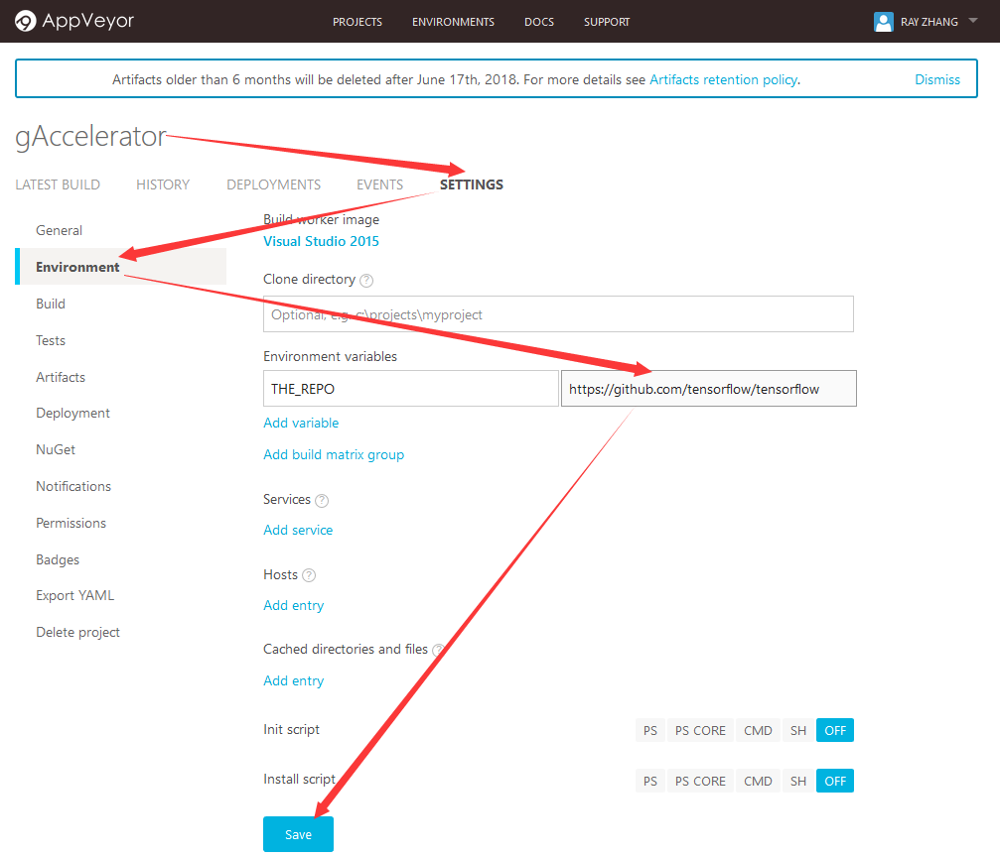
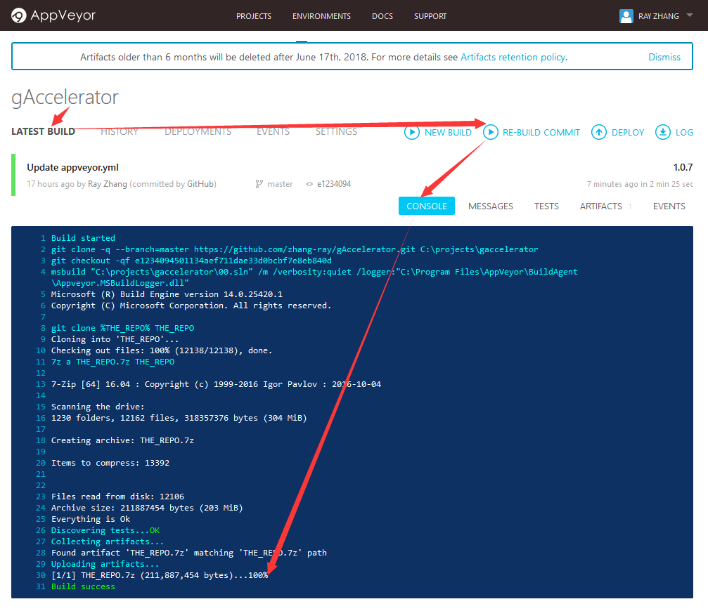
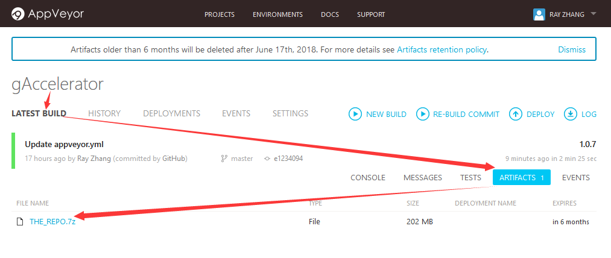

# gAccelerator
gAccelerator can accelerate `git clone`, `curl -o` and `youtube-dl` progress, which can be benefited for users behinds THE FIRE WALL...

## How to use it?
- Fork this project firstly;
- Sign in https://www.appveyor.com/ by your github account;
- Set the repo you wanted(or any other variables. see appveyor.yml for more details): 
- Trigger re-build for git clone 
- Download it!  

## Tech details
Just read the `./entry.sh` for more details...
